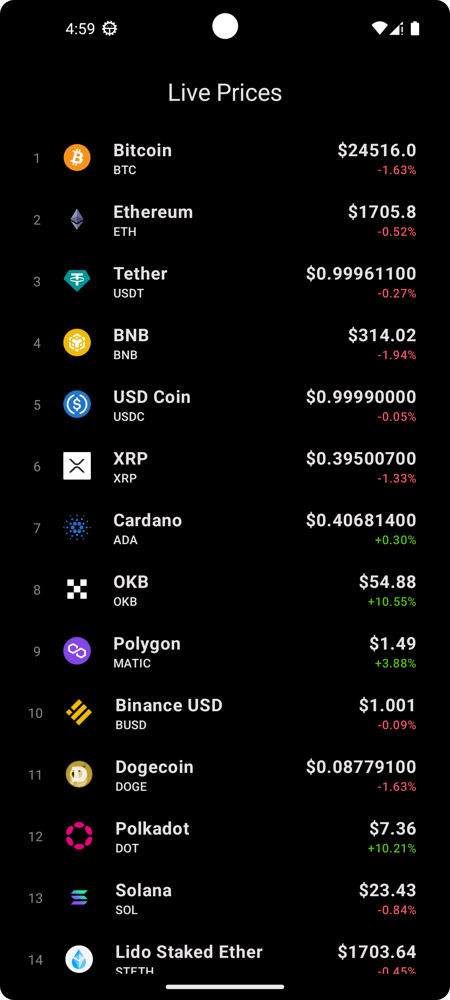

# Crypto Prices App

Application that lists the top 100 cryptocurrencies and shows a details page of each one, using the [CoinGecko API](https://www.coingecko.com/en/api) to get the information.

Try it out in the [Releases section](https://github.com/xtommas/cryptoAppAndroid/releases)!

## 🧠 Concepts used

- MVVM
- Clean Architecture
- Jetpack Compose
- Integrate Android Views in a Jetpack Compose app
- Getting data from APIs using Retrofit
- Dependency injection with Hilt
- Using third party libraries for graphs ([Spark](https://github.com/robinhood/spark))
- Dark mode and light mode support

## 📸 Screenshots

<!-- 

 -->

  
&nbsp; &nbsp; &nbsp; &nbsp;
  

  
&nbsp; &nbsp; &nbsp; &nbsp;
  

